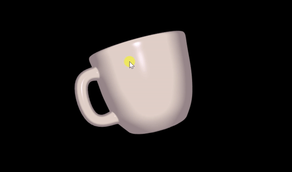
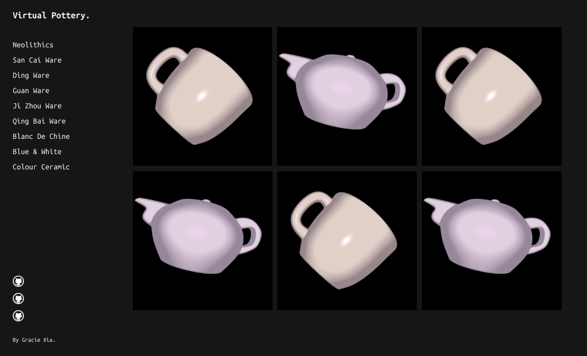
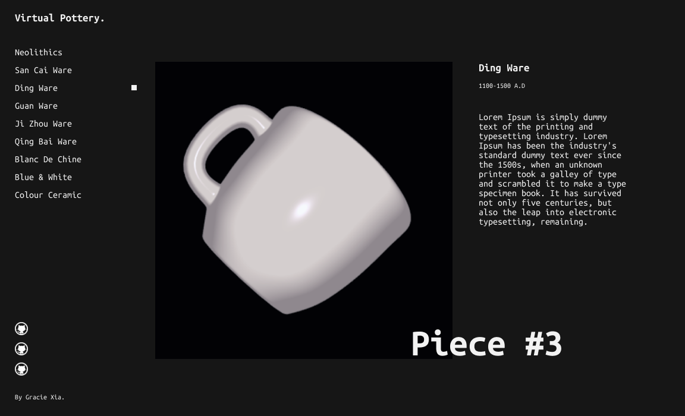

# Virtual_Pottery
View Demo Here :D 

https://graciexia8.github.io/Virtual_Pottery

*Update, some pot samples

I am currently conducting preliminary research on Chinese ceramics, including different kinds of wares throughout history, textures, lighting & patterns. I've gathered some references on different kinds of pottery and am producing concept art for myself as guidance for the models. Progress of this research can be found here:

https://graciexia.co/virtualpottery

I plan on then using these references to create UV Maps and Models in Blender. Then I will export them as .JSON files and hook it up to the broswer using the WebGL API. The final result might be an interactive gallery, I have not yet decided, maybe even a timeline that can create a narrative of Chinese history using ceramics. I don't plan on using any additional graphics libraries such as Three.js other than maybe a matrix library to help me do some linear algebra. This project is meant to be an application of all the WebGL knowledge I've acquired in the last three months. So I'm going to sit through make the shaders, hookup the files, write the Javascript on my own.

Right now though, I'm focused on the design and creation of these virtual pots :)

Eventually, I want my final product to look something like this:

Resources Used:  
http://learnwebgl.brown37.net/index.html  
https://youtu.be/vMPGTTVqlUA  
https://www.youtube.com/playlist?list=PLjcVFFANLS5zH_PeKC6I8p0Pt1hzph_rt  
http://www.cs.toronto.edu/~jacobson/phong-demo/  
